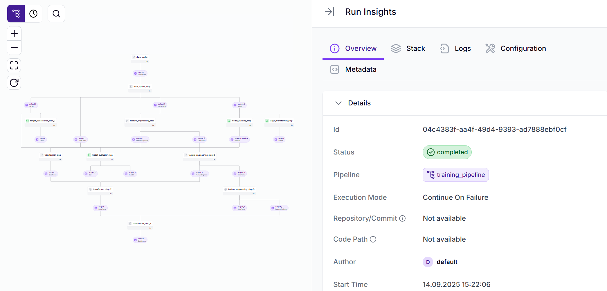
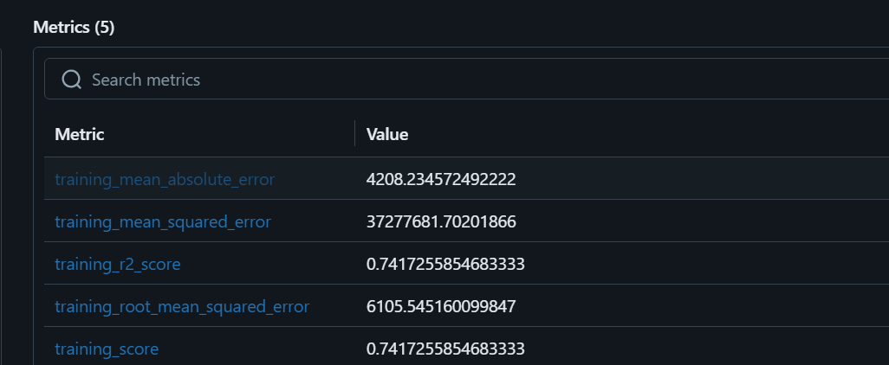

# Medical Cost Prediction

End-to-end regression project for predicting medical insurance charges, organized as a reproducible ML pipeline with ZenML and MLflow experiment tracking.

## Stack

- Python
- scikit-learn
- ZenML
- MLflow
- pandas

## Pipeline

Data loading → train/test split → feature engineering → model training → evaluation.

The current training step uses a scikit-learn `LinearRegression` pipeline with preprocessing for numerical and categorical features.



## Experiment tracking

MLflow is used to track runs, metrics, parameters, and model artifacts.



## Run locally

```bash
python -m venv .venv
source .venv/bin/activate       # Windows: .\.venv\Scripts\activate
pip install -r requirements.txt
python run_pipeline.py
```

After the pipeline runs, the command for opening the MLflow UI is printed in the terminal.
